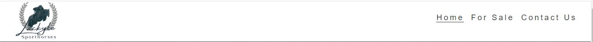
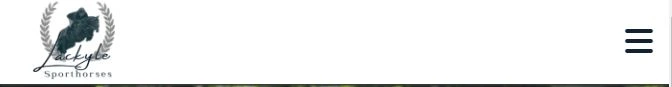
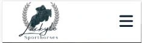
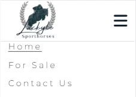

## Lackyle Sporthorses

Lackyle Sporthorses is a small equestrian business based in Craughwell, Co Galway, Ireland. Its business concerns the breeding, producing and sourcing horses for a variety of equestrian spheres. Their clientele consists of both national and international clients designed to be a responsive website that offers visitors a fluid layout that will change to accommodate a variety of different devices and screen viewing sizes.

The target audience is anyone looking to have a horse schooled for competition or prepared for sale. It also provides horses for sale for clients who wish to purchase a horse or to receive coaching on their horse.

The goal of the site is to provide potential clients with an overview of the business and to provide easy-to-follow information about the business, the services it offers, current stock available for sale and its location. 

Link to live site:
## Contents

## User Experience

### Site Owner Goals
*   To be able to view the site on a range of device sizes.

*   For users to easily navigate the site.

*   To make it easy for each visitor and/or potential customer to ascertain what services Lackyle Stables offer.

*   To make it easy for potential customers to find out what horses Lackyle Stables have available for sale.

*   To allow users to obtain an accurate description of each horse for sale through a variety of media namely text, photo and video.

*   To make it easy for an end user to contact Lackyle Stables either by way of the contact form, the Phone number, email or postal address located in the footer.

*   To allow users to identify the location of Lackyle Stables via  the postal address in the footer and also by viewing the google-map image.

### First Time Visitor Goals

•   As a user, I want to be able to navigate the website using a variety of devices.

•   As a user, I want to be able to find general information about Lackyle Stables.

•   I want to find out what services Lackyle Stables offers.

•	I want to be able to navigate the site easily to find information.

•	As a user I want to be able to find out what horses Lackyle Stables currently have for sale.

•	I want to be able to find a description of each horse for sale.

•	I want to be able to view both images and videos of horses for sale.

•	I want to be able to contact Lackyle Stables.

•	I want to be able to find their various social media profiles.

### Returning Visitor / Frequent Visitor Goals
•	I want to find up-to-date information on what Lackyle Stables have been up to via social media.

•	I want to be able to find out what stock they currently have for sale.

•	I want to be able to find a description of each horse for sale.

### Features to Achieve Goals 
•	The website will be built with a mobile-first approach, to ensure it is responsive. I will also test it on various devices and screen sizes.

•	General information about Lackyle Sables will be included on the Home page.

•	The Horses offered for sale will be presented on a page called For Sale. Each horse for sale will have a profile picture with a basic description. The user will then click on a button to obtain a more detailed description of each horses, which will include photos and video.

•	A contact form asking for the user's contact details will be included on a separate contact page.

## Wireframes
I created wireframes to visualize my ideas using Balsamiq. As I want to stick to the mobile-first approach I created wireframes for mobile, tablet and desktop screen sizes.

## Site Structure
The website is comprised of five pages, three of which are accessible from the navigation menu (home page, for sale page & contact us page). The fourth page is a thank you page which is shown once a user submits the contact form on the contact page and the fifth page is a 404 page which will be shown if the user encounters an error on the site.

All pages will have:

* A responsive navigation bar. Which when viewed on larger screen sizes such as a laptop or desktop, will be at the top right side of the header. This allows the user to navigate through the site via page links to the home, for sale, and contact pages.

* On the left side of the header opposite the navigation elements, we have a logo for Lackyle Sporthorses which also acts as a link to the home page.

* On smaller screen sizes such as mobile phones or tablets to allow for a good user experience of the site, the Lackyle Sporthorses navigation menu text is hidden with a media query to prevent the navigation bar from being cluttered. 

* When viewing the site with mobile devices and/or tablets the navigation links change to a toggle menu with the use of a burger icon. This was implemented to give the site a clean and non-cluttered appearance, as well as providing a good user experience. Given that most users would already be familiar with seeing and using the burger icon when navigating websites on mobile and other smaller-screen devices.

* A footer that contains links and icons for the four main social media platforms namely Facebook, Instagram, Twitter and YouTube. 

* A location icon to show Lackyle Stables address, a phone icon to indicate Lackyle Stables phone number and an envelope icon that takes the user to the contact page. Icons were used to keep the footer clean because they are universally recognisable.

* A map image was also included to point users to Lackyle Stables location this image is static at the moment but it is intended to activate it going forward.

## Features

### Header

The header which includes a navigation menu is fixed to improve user experience. This way the user can easily navigate the website and click on another page from anywhere on the site. 

*   Positioned at the top of the page.
*   Contains the business logo on the left side.
*   Contains navigation menu links on the right side

### Navigation Menu

*   As part of my mobile-first approach, I followed the Code Institute Love Running tutorial on how to implement a hamburger menu without JavaScript. I used the example code provided in the Love Running project for my navigation.

*   Navigation Links 

    *   HOME – directs the user to the home page where users can learn about the business Lackyle Sporthorses.

    *   FOR SALE – leads to a page where users can see horses available for sale at Lackyle Sporthorses.

    *   CONTACT US – directs the user to the contact form where they can get in touch with Lackyle Stables.

*   The links have an animated hover effect and an underline on the active page.

*   The navigation is clear and easy for the user to understand and navigate.

*   The navigation bar is responsive:
    *   On tablets and mobile devices: the navigation bar has the business logo on the left side and a toggle menu activated by a burger icon on the right side.

*   When the hamburger menu is clicked, a dropdown menu appears with links in the same order as displayed on larger screen sizes.

*   The links have an underlined effect on the active page.

### Home Page

*   Represents the main information about Lackyle Stables and the services they provide.

#### Hero Section
*   Below my navigation, I have a hero image. On the Home page, the hero is bigger than on the other pages. I added an overlay text box on top of the hero image to make sure that the text is readable.

![hero]

#### Main Section
*   Below the hero image is the main body section which:

    *   Contains an About Us section which provides information about Lackyle Sporthorses.
    *   An Our Services section that provides a list of services that Lackyle Sporthorses offer.
    The Our Services section also contains a background image.

![]
#### Footer

