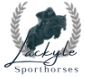
# Lackyle Sporthorses

Lackyle Sporthorses is a small equestrian business based in Craughwell, Co Galway, Ireland. Its business concerns the breeding, producing and sourcing horses for a variety of equestrian spheres. Their clientele consists of both national and international clients designed to be a responsive website that offers visitors a fluid layout that will change to accommodate a variety of different devices and screen viewing sizes.

The target audience is anyone looking to have a horse schooled for competition or prepared for sale. It also provides horses for sale for clients who wish to purchase a horse or to receive coaching on their horse.

The goal of the site is to provide potential clients with an overview of the business and to provide easy-to-follow information about the business, the services it offers, current stock available for sale and its location. 

Link to live site: [Lackyle Sporthorses](https://amandab2023.github.io/P1_Lackyle_Sporthorses/index.html)

## Contents
*   User Experience
    *   Site Owner Goals
    *   First Time User Goals
    *   Returning Visitor/ Frequent User
    *   Features to Achieve Goals
*   Site Structure
*   Features
    *   Header
    *   Navigation Menu
    *   Home Page
        *   Hero
        *   Main
        *   Footer
    *   For Sale Page
    *   Contact Page
    *   Response Page
*   Technologies Used
*   Design
    *   Color Scheme
    *   Typography
*   Wireframes
*   Testing
*   Deployment
    *   Deployment to Github pages
    *   Local Deployment
*   Future Improvements
*   Credits
    *   Content
    *   Media
    *   Tools
*   Acknowledgments

## User Experience

### Site Owner Goals
*   To be able to view the site on a range of device sizes.

*   For users to easily navigate the site.

*   To make it easy for each visitor and/or potential customer to ascertain what services Lackyle Stables offer.

*   To make it easy for potential customers to find out what horses Lackyle Stables have available for sale.

*   To allow users to obtain an accurate description of each horse for sale through a variety of media namely text, photo and video.

*   To make it easy for an end user to contact Lackyle Stables either by way of the contact form, the Phone number, email or postal address located in the footer.

*   To allow users to identify the location of Lackyle Stables via the postal address in the footer and also by viewing the google-map image.

### First Time Visitor Goals
*   As a user, I want to be able to navigate the website using a variety of devices.

*   As a user, I want to be able to find general information about Lackyle Stables.

    I want to find out what services Lackyle Stables offers.

*   I want to be able to navigate the site easily to find information.

*   As a user, I want to be able to find out what horses Lackyle Stables currently have for sale.

*   I want to be able to find a description of each horse for sale.

*   I want to be able to view both images and videos of horses for sale.

*   I want to be able to contact Lackyle Stables.

*   I want to be able to find their various social media profiles.

### Returning Visitor / Frequent Visitor Goals

*   I want to find up-to-date information on what Lackyle Stables have been up to via social media.

*   I want to be able to find out what stock they currently have for sale.

*   I want to be able to find a description of each horse for sale.

### Features to Achieve Goals

*   The website will be built with a mobile-first approach, to ensure it is responsive. I will also test it on various devices and screen sizes.

*   General information about Lackyle Sables will be included on the Home page.

*   The Horses offered for sale will be presented on a page called For Sale. Each horse for sale will have a profile picture with a basic description. The user will then click on a button to obtain a more detailed description of each horse, which will include photos and videos.

*   A contact form asking for the user's contact details will be included on a separate contact page.

## Site Structure
The website is comprised of five pages, three of which are accessible from the navigation menu (home page, for sale page & contact us page). The fourth page is a thank you page which is shown once a user submits the contact form on the contact page and the fifth page is a 404 page which will be shown if the user encounters an error on the site.

All pages will have:

* A responsive navigation bar. Which when viewed on larger screen sizes such as a laptop or desktop, will be at the top right side of the header. This allows the user to navigate through the site via page links to the home, for sale, and contact pages.

* On the left side of the header opposite the navigation elements, we have a logo for Lackyle Sporthorses which also acts as a link to the home page.

* On smaller screen sizes such as mobile phones or tablets to allow for a good user experience of the site, the Lackyle Sporthorses navigation menu text is hidden with a media query to prevent the navigation bar from being cluttered. 

* When viewing the site with mobile devices and/or tablets the navigation links change to a toggle menu with the use of a burger icon. This was implemented to give the site a clean and non-cluttered appearance, as well as to provide a good user experience. Given that most users would already be familiar with seeing and using the burger icon when navigating websites on mobile and other smaller-screen devices.

* A footer that contains links and icons for the four main social media platforms namely Facebook, Instagram, Twitter and YouTube. 

* A location icon to show Lackyle Stables address, a phone icon to indicate Lackyle Stables phone number and an envelope icon that takes the user to the contact page. Icons were used to keep the footer clean because they are universally recognisable.

* A map image was also included to point users to Lackyle Stables location this image is static at the moment but it is intended to activate it going forward.

## Features

### Header

The header which includes a navigation menu is fixed to improve user experience. This way the user can easily navigate the website and click on another page from anywhere on the site. 

*   Positioned at the top of the page.
*   Contains the business logo on the left side.
*   Contains navigation menu links on the right side

### Navigation Menu

*   As part of my mobile-first approach, I followed the Code Institute Love Running tutorial on how to implement a hamburger menu without JavaScript. I used the example code provided in the Love Running project for my navigation.

*   Navigation Links 

    *   HOME – directs the user to the home page where users can learn about the business Lackyle Sporthorses.

    *   FOR SALE – leads to a page where users can see horses available for sale at Lackyle Sporthorses.

    *   CONTACT US – directs the user to the contact form where they can get in touch with Lackyle Stables.

*   The links have an animated hover effect and an underline on the active page.

*   The navigation is clear and easy for the user to understand and navigate.

*   The navigation bar is responsive:
    *   On tablets and mobile devices: the navigation bar has the business logo on the left side and a toggle menu activated by a burger icon on the right side.

*   When the hamburger menu is clicked, a dropdown menu appears with links in the same order as displayed on larger screen sizes.

*   The links have an underlined effect on the active page.

### Home Page

*   Represents the main information about Lackyle Stables and the services they provide.

#### Hero Section
*   Below my navigation, I have a hero image. On the Home page, the hero is bigger than on the other pages. I added an overlay text box on top of the hero image to make sure that the text is readable.

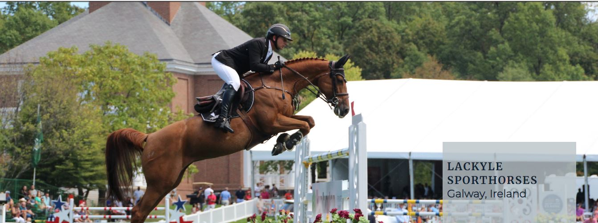

#### Main Section
*   Below the hero image is the main body section which:

    *   Contains an About Us section which provides information about Lackyle Sporthorses.

    *   An Our Services section that provides a list of services that Lackyle Sporthorses offers.
    *   The Our Services section also contains a background image.

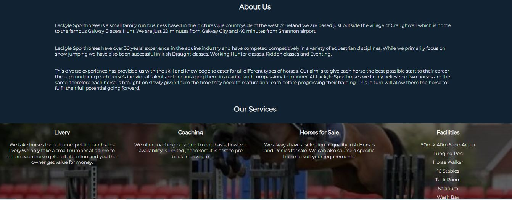

#### Footer

*   The footer contains business contact details :

    *   Address
    *   Telephone
    *   Email
    *   Location Map- using google maps iframe link.

*   The footer also contains social media links with a hover effect which when clicked will open a new tab.

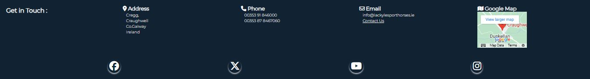

### For Sale Page
*   The header and footer are the same as the homepage.

*   While the main body section consists of three picture boxes with some writing. Each box then has a button that allows the user to see more information about each individual horse.

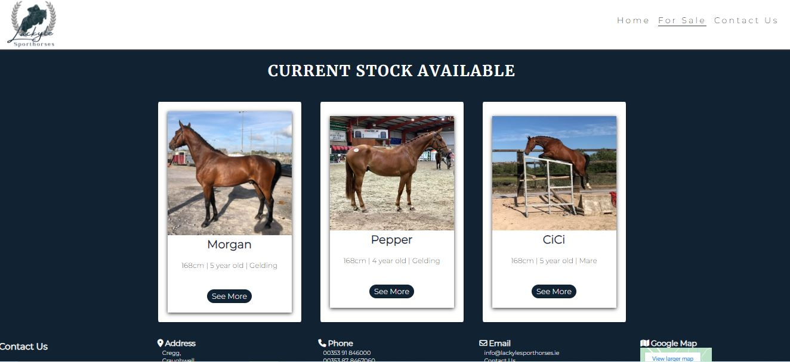

### Contact Page
*   The header and footer are the same as the homepage.
*   The contact page then has a background image with a form overlay that the user can fill in to contact Lackyle Sporthorses.
    *   All text input fields are customized
    *   Labels are animated when the input field is in focus and are not empty.
    *   First name, Last name, and email are set to required, while Enquiry and Phone number are not.
    *   The submit button is animated on hover.

*   The page is responsive on all common screen sizes.

*   The submit button leads to the response page.​

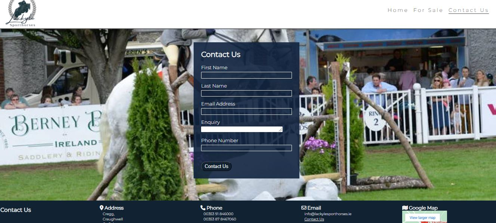

### Response Page / Thank You Page

*   Response page appears after submitting the contact form.
*   It contains the thank you message and the promise to get in back to the user as soon as possible.
*   It will automatically direct the user to the main page in 10 seconds.

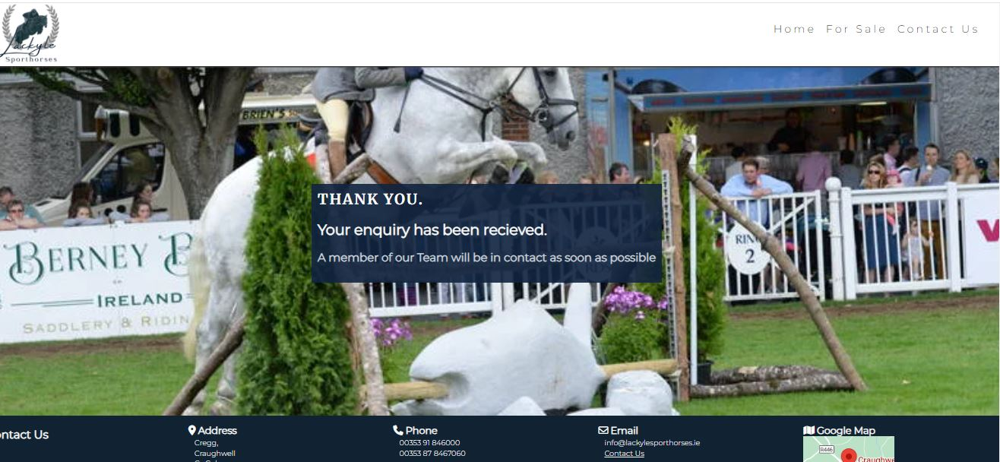

## Technologies Used

*   HTML was used as the foundation of the site.
*   CSS - was used to add the styles and layout of the site.
*   CSS Flexbox - was used to arrange items on the pages.
*   Balsamiq was used to make wireframes for the website.
*   VSCode was used as the main tool to write and edit code.
*   Git was used for the version control of the website.
*   GitHub was used to host the code of the website.
*   Canva was used to resize images.
*   Chrome screen recorder plugin was used to create gifs.
*   W3C CSS Validation [W3C CSS Validation](https://jigsaw.w3.org/css-validator/)
*   W3C Markup Validation [W3C Markup Validation](https://validator.w3.org/)

## Design

### Color Scheme
As Lackyle Stables already have their own colors, I worked these into the website. The background is mostly blue as the color blue can increase user engagement and conversion rates. The text on the blue background is white in order to make it stand out. This color combination is revered on buttons and a light grey is introduced for contrast. This is the same with the buttons and the hover element. While the social media icons transition to their signature colors when hovered over.

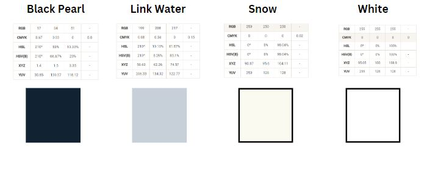

### Typography

Merriweather was used for all the h1 elements while Montserrat was used for the other heading elements and the body text, with a back up of San Serif. These are two fonts I would be familiar with and felt they paired well together, as the website looked professional yet modern.

*   Merriweather

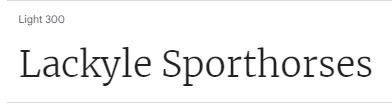

*   Montserrat

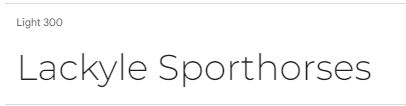

## Wireframes

The wireframes for the website were designed using Balsamiq. The designs vary from the end layout in some places due to creative decisions made throughout the development process.

*   Home
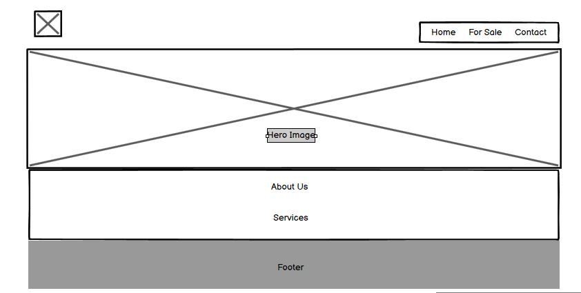

*   For Sale
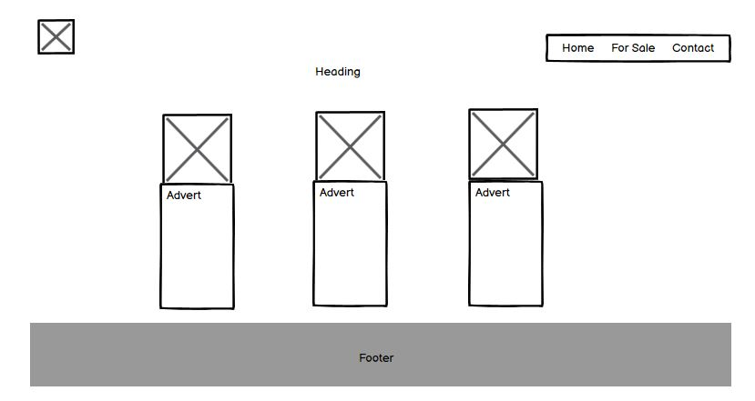

*   Contact
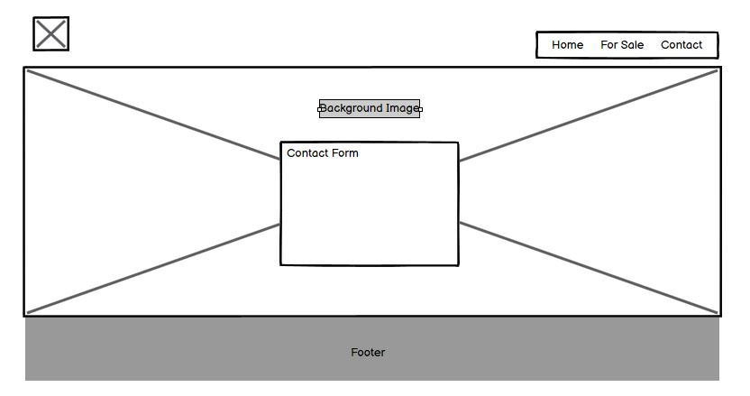

## Testing

Please refer to the  file for all test-related documentation.

## Deployment

#### Deployment to GitHub Pages
The site was deployed to GitHub pages. The steps to deploy are as follows:
*   In the GitHub repository, navigate to the Settings tab
*   From the source section drop-down menu, select the Main Branch, then click "Save".
*   The page will be automatically refreshed with a detailed ribbon display to indicate the successful deployment.

The live link can be found here: [Github](https://amandab2023.github.io/P1_Lackyle_Sporthorses/index.html)

#### Local Deployment
In order to make a local copy of this project, you can clone it. In your IDE Terminal, type the following command to clone my repository.

1.   Sign in to GitHub, locate the repository and click to open the repository.

2.   On the repository main page, click the green code button where the files are located. 

3.   This will open a drop down menu.

4.   In the dropdown menu stay on the HTTPS option and click the copy icon button next to the URL to copy it.

5.   Next open Git Bash and type git clone and your directory link.#

6.  Then type cd and the directory name.

7. Then code . to open VS Studio using Windows.

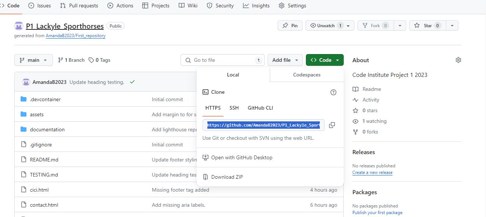

## Future Improvments

*   add custom 404 page
*   add fully functional contact form.
*   make improvements to the advert pages to make them more interactive.
*   improve my commit messages.
*   I must also get better at making wireframes as I found balsamiq difficult to get used to.

## Credits

#### Content
*   I got the colors for the social media icons from [Us Brand Colors](https://usbrandcolors.com/instagram-colors/)
*   Fonts were imported from Google Fonts.
*   Icons were imported from Font Awesome.
*   The Code Institute Love Running project for the basic website structure and toggle menu.

#### Media

*   Hero image on homepage was taken from [Pexels](https://www.pexels.com)
*   The logo I created myself using Canva.
*   All other images and videos on the website are my own.

Tools
*   Canva was used to create the logo and to resize the images where needed.[Canva](https://www.canva.com)
*   Snipping Tool was used to take pictures of my screen for testing.
*   Freeconvert was used to convert my images from jpg or png to webp.
*   Google screen recorder for taking video to make gifs.
*   Veed [Veed](https://www.veed.io/convert/webm-to-gif) to convert my videos into gifs.

## Acknowledgments

*   First and foremost my mentor Juliia Konovalova for all her advice and guidance on this first project. She was a great help throughout.

*   Code Institute tutors and Slack community members for their support and help.
*   Kevin Powell for his CSS tutorials.

*   [Link](https://www.digital.ink/blog/mobile-responsive-youtube-embeds/) where I got information on how to embed my youtube videos and make them responsive.

*   Youtube : [Link](https://www.youtube.com/watch?v=9FNNkzPBFcE) where I got the idea for the cards on the for sale page.