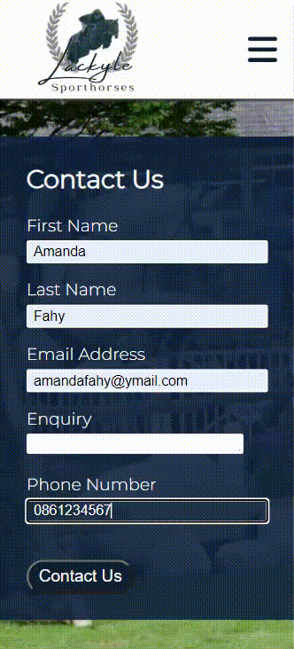

# Testing

## Compatability

In order to ensure the website has the correct compatabilty, functionality and responsiveness , I checked it on both Microsoft Edge and Google Chrome.

*   Microsoft Edge

*   Google Chrome

## Responsiveness

The website was also checked manually using Devtools on both Microsoft Edge and Google Chrome.

*   Home Page

*   For Sale Page

*   Morgan Page 

*   Pepper Page

*   Cici Page

*   Contact Us Page

*   Thank You Page

### Responsive Viewer
The website was also checked using the responsive viewer extentions on google chrome which shows the website on various different screen sizes.

*   Home

*   For Sale

*   Morgan

    
*   Pepper

*   Cici

*   Contact

*   Thank You

The website was also checked using [link](https://responsivedesignchecker.com/) on various different screen sizes.

*   Desktop
*   Tablet
*   Mobile

## Manual Testing

| feature | action | expected result | tested | passed | comments |
| --- | --- | --- | --- | --- | --- |
| Navbar | | | | | |
| Home | Click on the "Home" link | The user is redirected to the main page | Yes | Yes | - |
| For Sale | Click on the "For Sale" link | The user is redirected to the for sale page | Yes | Yes | - |
| Contact | Click on the "Contact" link | The user is redirected to the contact page | Yes | Yes | - |
| Footer | | | | | |
| Instagram icon in the footer | Click on the Instagram icon | The user is redirected to the Instagram page | Yes | Yes | - |
| Facebook icon in the footer | Click on the Facebook icon | The user is redirected to the Facebook page | Yes | Yes | - |
| Twitter icon in the footer | Click on the Twitter icon | The user is redirected to the Twitter page | Yes | Yes | - |
| YouTube icon in the footer | Click on the YouTube icon | The user is redirected to the YouTube page | Yes | Yes | - |
| Home page | | | | | |
| "Contact Us" button in footer section | Click on the "Contact Us" button | The user is redirected to the contact page | Yes | Yes | - |
| For Sale page | | | | | |
| "Read More" button in Hero section | Click on the "Read More" button | The user is redirected to each horses detailed advert page | Yes | Yes | - |
| Contact page | | | | | |
| First name input | Enter the first name | The first name is entered | Yes | Yes | If user doesn't enter the first name, the error message appears |
| Last name input | Enter the last name | The last name is entered | Yes | Yes | If user doesn't enter the last name, the error message appears |
| Email input | Enter the email | The email is entered | Yes | Yes | If user doesn't enter the email, the error message appears. If user enters not valid email, the error message appears |
| Enquiry input | Enter the enquiry message | The enquiry is entered | Yes | Yes | If user doesn't enter the enquiry, no error message appears, as optional.
| Phonenumber input | Enter the Phonenumber | The phonenumebr is entered | Yes | Yes | If user doesn't enter the phonenumber, no  error message appears, as optional.
| "Submit" button | Click on the "Submit" button | The user is redirected to the response page Thank You | Yes | Yes | - |
| Thank You page | | | | | |
| Response message | The user will be automatically redirected to the home page after 10 seconds | The user is redirected to the home page | Yes | Yes | - |

## Validator Testing