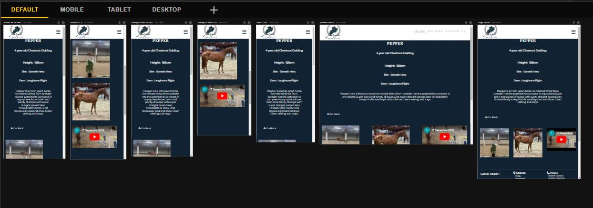
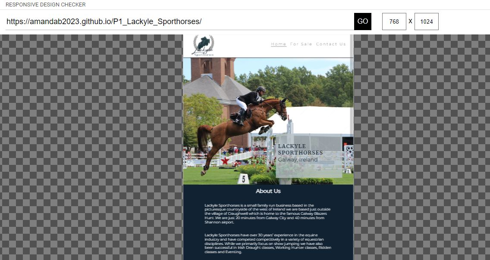
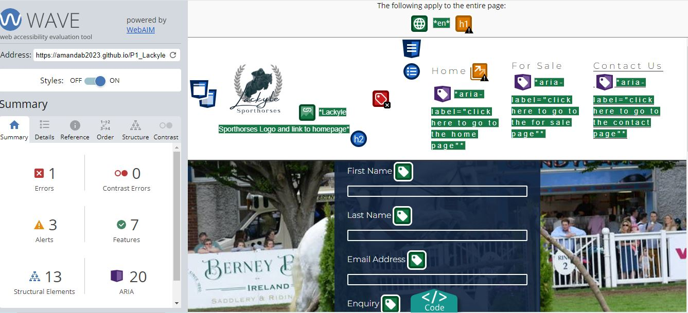

# Testing

## Compatability

In order to ensure the website has the correct compatability, functionality and responsiveness, I checked it on both Microsoft Edge and Google Chrome.

*   Microsoft Edge

*   Google Chrome

## Responsiveness

The website was also checked manually using Devtools on both Microsoft Edge and Google Chrome.

*   Home

*   For sale Page

*   For Sale Page advert (Morgan)

*   Contact

### Responsive Viewer
The website was also checked using the responsive viewer extention on google chrome which shows the website on various different screen sizes.

*   Home

*   For Sale

*   Morgan

    
*   Pepper

*   Cici

*   Contact

*   Thank You

### Responsive Design Checker

The website was also checked using [link](https://responsivedesignchecker.com/) on various different screen sizes.

*   Desktop

    *   24 inch Desktop

     

    *   22 inch Desktop

     

    *   15 inch Desktop

     

    *   10 inch Desktop

    

*   Tablet

    *   Ipad Mini

     

    *   Nexus 7

     

*   Mobile

    *   Iphone 3

     

     *  Iphone 

      

    *   Samsung Galexy 5/6/7

     

## Manual Testing

| feature | action | expected result | tested | passed | comments |
| --- | --- | --- | --- | --- | --- |
| Navbar | | | | | |
| Home | Click on the "Home" link | The user is redirected to the main page | Yes | Yes | - |
| For Sale | Click on the "For Sale" link | The user is redirected to the for sale page | Yes | Yes | - |
| Contact | Click on the "Contact" link | The user is redirected to the contact page | Yes | Yes | - |
| Footer | | | | | |
| Instagram icon in the footer | Click on the Instagram icon | The user is redirected to the Instagram page | Yes | Yes | - |
| Facebook icon in the footer | Click on the Facebook icon | The user is redirected to the Facebook page | Yes | Yes | - |
| Twitter icon in the footer | Click on the Twitter icon | The user is redirected to the Twitter page | Yes | Yes | - |
| YouTube icon in the footer | Click on the YouTube icon | The user is redirected to the YouTube page | Yes | Yes | - |
| Home page | | | | | |
| "Contact Us" button in footer section | Click on the "Contact Us" button | The user is redirected to the contact page | Yes | Yes | - |
| For Sale page | | | | | |
| "Read More" button in Hero section | Click on the "Read More" button | The user is redirected to each horses detailed advert page | Yes | Yes | - |
| Contact page | | | | | |
| First name input | Enter the first name | The first name is entered | Yes | Yes | If user doesn't enter the first name, the error message appears |
| Last name input | Enter the last name | The last name is entered | Yes | Yes | If user doesn't enter the last name, the error message appears |
| Email input | Enter the email | The email is entered | Yes | Yes | If user doesn't enter the email, the error message appears. If user enters not valid email, the error message appears |
| Enquiry input | Enter the enquiry message | The enquiry is entered | Yes | Yes | If user doesn't enter the enquiry, no error message appears, as optional.
| Phonenumber input | Enter the Phonenumber | The phonenumebr is entered | Yes | Yes | If user doesn't enter the phonenumber, no  error message appears, as optional.
| "Submit" button | Click on the "Submit" button | The user is redirected to the response page Thank You | Yes | Yes | - |
| Thank You page | | | | | |
| Response message | The user will be automatically redirected to the home page after 10 seconds | The user is redirected to the home page | Yes | Yes | - |

## Validator Testing
 All the code for every page of the site has been run through The W3C HTML Markup Validation Service and the The W3C CSS Markup Validation Service to test the code for any errors. On the final tests i did have errors on my full advert discription pages , mainly due to the youtube video emed and the lack of a tile to a section whch did not require a title

*   Home

*   For Sale

*   Morgan

*   Pepper

*   Cici

*   Contact

*   Thank You

*   CSS
 No errors or warnings were found when passing through the official W3C (Jigsaw) validator.

## Lighthouse Report

*   Home Page

*   For Sale Page

*   Contact Page

*   Advert Page (Morgan)

## Accessibility
I checked the accessability of the site using [wave](https://wave.webaim.org/)

the only issue raiseed was where I used html and css to create a toggle and the hidden X was showing an error because of this.

*   Home Page

*   For Sale Page

*   Sale Page

*   Contact Page

## Bugs

*   I did have some issues trying to get the hero image to be responsive and in the end i changed the image.

*   I also have an issue getting my for sale page to format corretly, but this was again doen to the images. In order to resolve this I edited the image using Canva before add it to the website.

## Unsolved Bugs
No known bugs apart from the Css issues mentioned above.

## Mistakes
I made afew mistakes when making my commits by using past tennce or not phrasing them coirrely and not given emough detail of what was changed. This is something which i will nedd to be more aware of going forward.